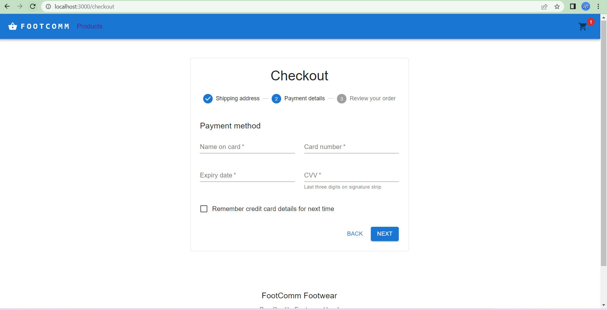

# Install dependecies
```bash
npm install
```

# Run json server
```bash
npm install -g json-server

json-server --watch db.json --port 3004
```

# Run the project
```bash
npm start
```

# Products Screen


# Products Info Screen


# Add To Cart Screen


# Address Screen


# Payment Screen


# Summary Screen


# Placed Order Screen
